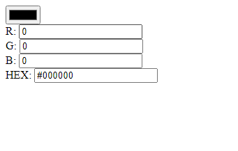

# Color Picker

A simple and elegant web-based color picker tool that allows users to select a color and view its RGB and HEX values. This project is built using HTML, CSS, and JavaScript.

## Features

- Select colors using a color input element
- Display RGB and HEX values of the selected color
- Responsive and clean user interface
